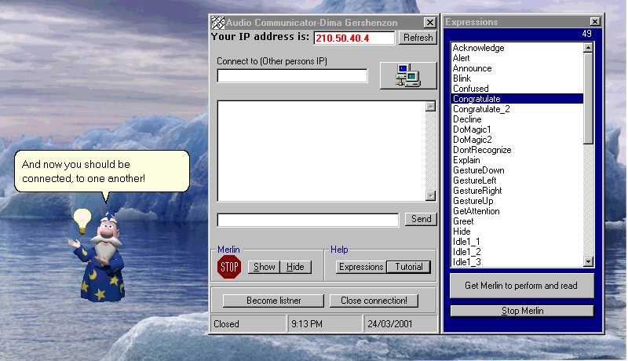



## Audio Chat Communicator

### Description

Better then MSN MESSENGER? You decide:

This nifty little program, is very cool. It is a simple IP chat program, that actualy TALKS the MESSAGES sent to you by the other side. NOT only that, you can also send FACIAL EXPRESSIONS, which your CHARACTER will perform to you.

The program also comes with a very good little AUDIO tutorial that I put in.It explains all the functions and how to use them.
 
### More Info
 
YOu need Windows ME, or Windows 2000, or if you already have the MICROSOFT TTS engine installed, dont worry about downloading the files,otherwise you have to download 2 addtional files:

http://activex.microsoft.com/activex/controls/agent2/tv_enua.exe

http://agent.microsoft.com/agent2/chars/Merlin.exe

and if you havent got the microsoft agent panel:

http://activex.microsoft.com/activex/controls/agent2/MSagent.exe

If you plan to open up the FORM not the PROJECT here are the 2 controls you need:

microsoft agent control

MIcrosoft Winsock control

Turn your speakers UP, and enjoy, as I have tried to handle most of the common error problems, that arise becasue of Little mishaps around the keyboard.

             |
---                |---
**Submitted On**   |2001-03-24 21:04:20
**By**             |[N/A](https://github.com/Planet-Source-Code/PSCIndex/blob/master/ByAuthor/empty.md)
**Level**          |Intermediate
**User Rating**    |4.8 (19 globes from 4 users)
**Compatibility**  |VB 6\.0
**Category**       |[Internet/ HTML](https://github.com/Planet-Source-Code/PSCIndex/blob/master/ByCategory/internet-html__1-34.md)
**World**          |[Visual Basic](https://github.com/Planet-Source-Code/PSCIndex/blob/master/ByWorld/visual-basic.md)
**Archive File**   |[CODE\_UPLOAD174973242001\.zip](https://github.com/Planet-Source-Code/audio-chat-communicator__1-21893/archive/master.zip)

